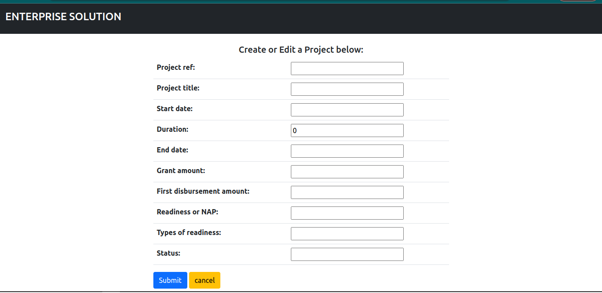
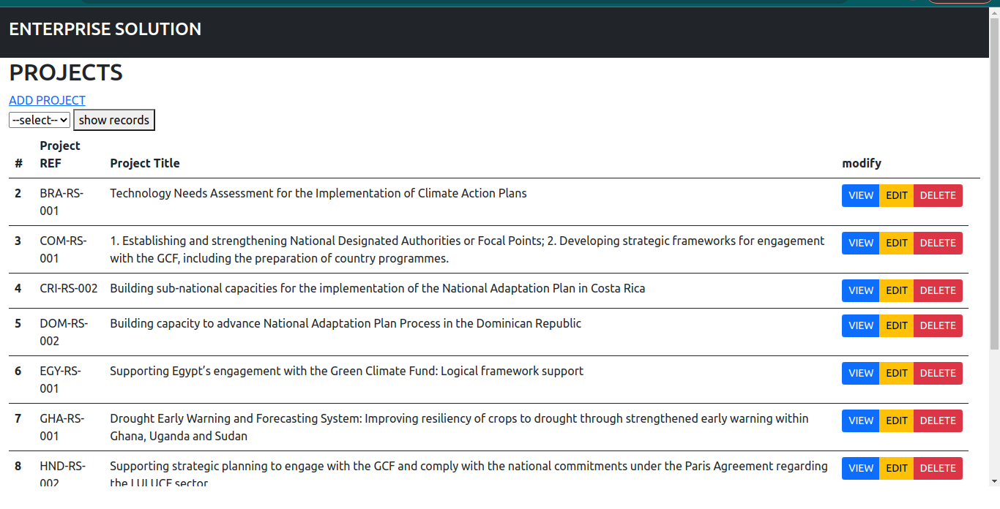
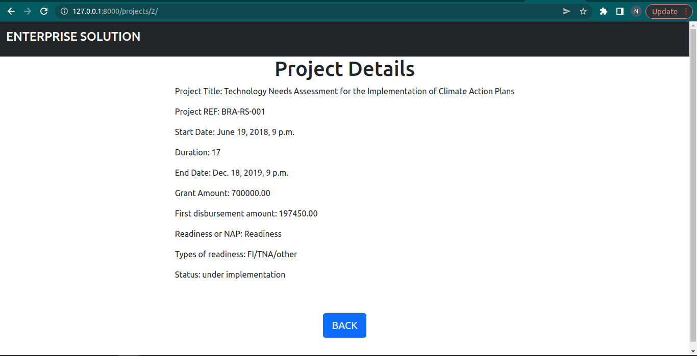
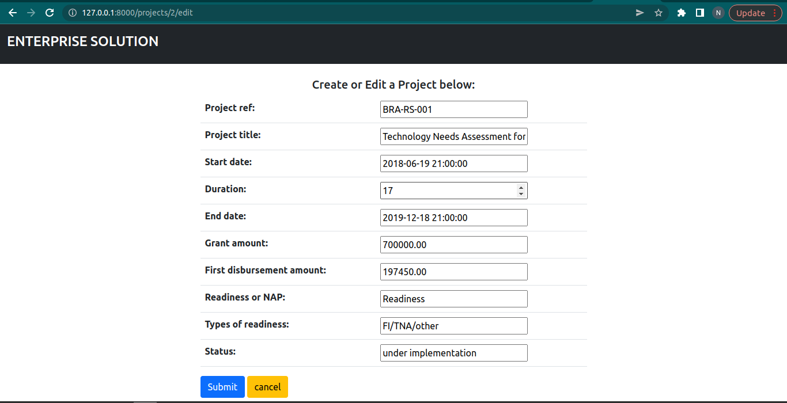
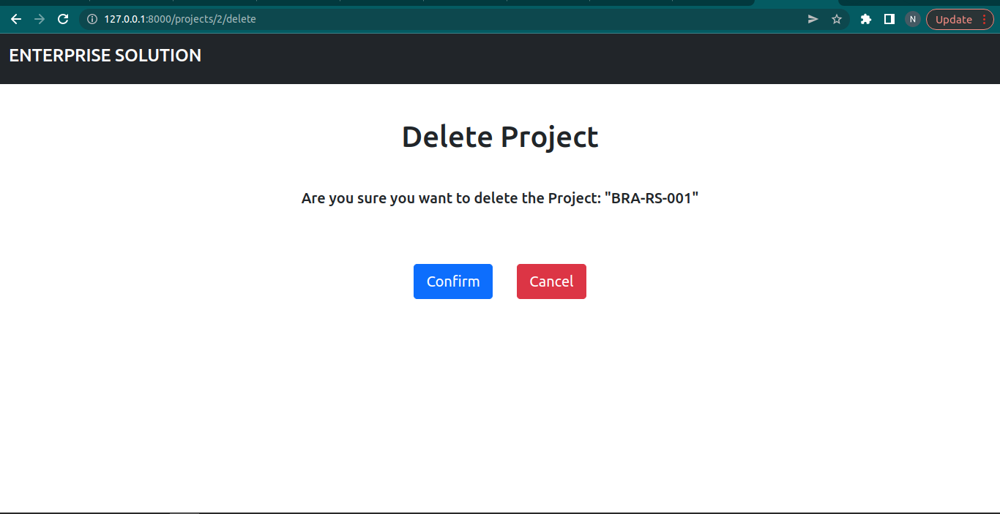
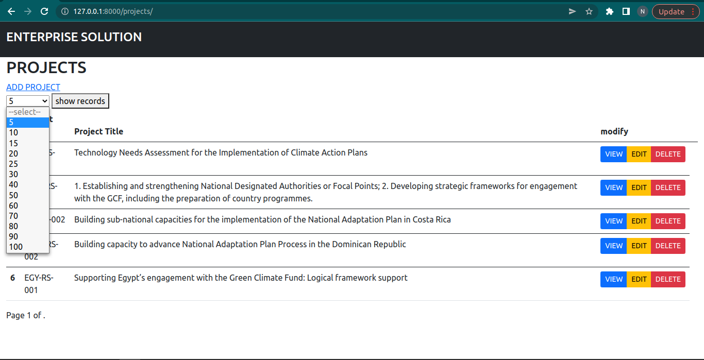
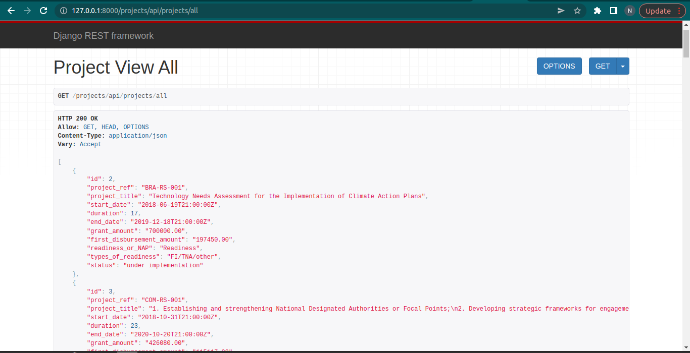

##### Enterprise Solutions Section
#### prerequisite
- postgresql installed
- python3+

create venv
`python3 -m venv venv`
##### activate venv
`source/venv/bin/activate`
##### install requirements
`pip3 install -r requirements.txt`
#### create a postgres database:
'NAME': 'enterprise',
'USER': 'enterprise',
'PASSWORD': 'password',

#### load dumped data
location:
EnterpriseSolution/data/enterprise.sql

#### run migrations
`python manage.py makemigrations`
`python manage.py migrate`
`python manage.py runserver`
#### navigate to 
http://127.0.0.1:8000/projects/

#### API
- add country name within brackets
http://127.0.0.1:8000/projects/api/projects/country/<kenya>
- add status within brackets
 http://127.0.0.1:8000/projects/api/projects/status/<completed>
- to view all projects
 http://127.0.0.1:8000/projects/api/projects/all 

 #### data
 - you will find the csv files for the normalized raw data

 #### demo
 #### create a project
 - click on ADD PROJECT
 

 #### view all projects
 - go to http://127.0.0.1:8000/projects/
 

 #### view a project
 - click on VIEW
 

 ##### edit a project
 - click on EDIT
 

 #### delete a project
 - click on DELETE
 

#### select number of entries to display
- click select button
- select number of entries
- click show records button to display

#### API view all projects
- go to:
- http://127.0.0.1:8000/projects/api/projects/all

